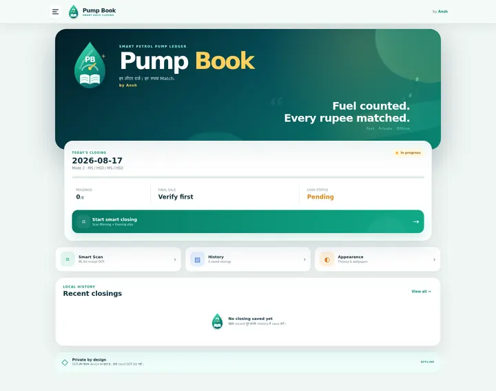
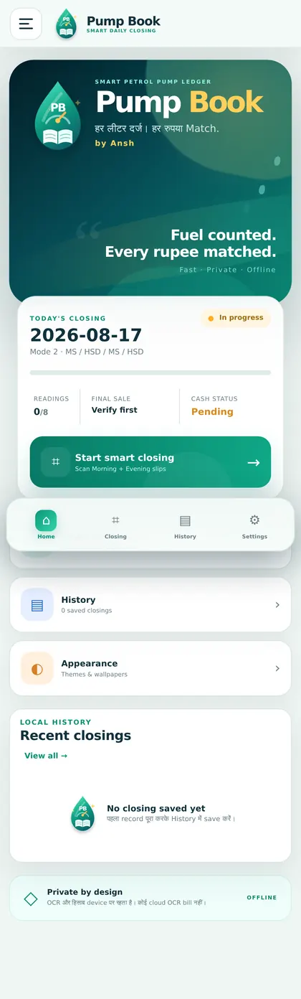
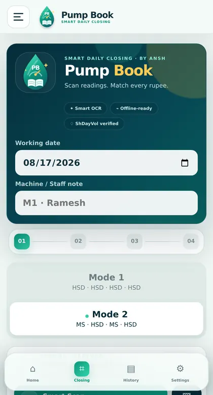
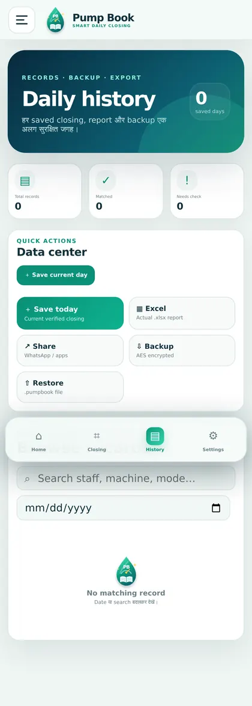
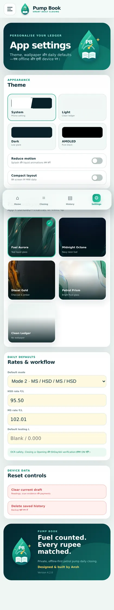
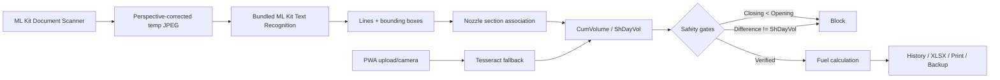

<p align="center">
  
</p>

<p align="center">
  <a href="https://anshyd1.github.io/Pump-book/"></a>
  <a href="https://github.com/anshyd1/Pump-book/releases/tag/v4.2.0"></a>
  
  
</p>

<h1 align="center">Pump Book <sub>4.2</sub></h1>
<p align="center"><b>हर लीटर दर्ज। हर रुपया Match.</b><br>Smart petrol-pump daily closing, totalizer OCR, fuel sale and payment reconciliation.</p>
<p align="center"><b>Designed &amp; built by Ansh</b></p>

---

## 🚀 Get Pump Book

| Target | Download | Best for |
|---|---|---|
| **Live PWA** | **[Open Pump Book](https://anshyd1.github.io/Pump-book/)** | Browser, desktop and Add to Home Screen |
| **Android ARM64** | **[Download APK](https://github.com/anshyd1/Pump-book/releases/download/v4.2.0/Pump-Book-4.2.0-arm64-debug.apk)** | Most phones released after 2017 |
| **Android ARMv7** | **[Download APK](https://github.com/anshyd1/Pump-book/releases/download/v4.2.0/Pump-Book-4.2.0-armv7-debug.apk)** | Older 32-bit Android phones |

The APK uses bundled Google ML Kit Text Recognition for fast, on-device OCR. The installable PWA remains the offline fallback.

> **One-time 4.1.3 → 4.2.0 test-build transition:** the earlier ephemeral debug signing key was not retained. Android may require: **Backup in 4.1.3 → uninstall 4.1.3 → install 4.2.0 → Restore backup**. The package name remains `in.pumpbook.app`.

### APK integrity

```text
f842a34dde9ea1f0e3662376ecac75f50b972e663cee82eca5c238c26770b09a  Pump-Book-4.2.0-arm64-debug.apk
2d3eeaf00ad55640e78d8efbb56a458271a063fcb14e9abb9ad120a6dc92ae5d  Pump-Book-4.2.0-armv7-debug.apk
```

Both APKs verify with Android APK Signature Scheme v1 and v2.

---

## ✨ What is new in 4.2

<table>
<tr><td width="50%" valign="top">

### 💧 Liquid Pump Book identity
- New fuel-drop + ledger + gauge logo
- Short paint-swipe opening animation
- Premium Home dashboard
- **Fuel counted. Every rupee matched.**
- **by Ansh** brand signature

</td><td width="50%" valign="top">

### 🧭 Real app navigation
- Home dashboard
- Dedicated Closing workflow
- Separate History/Data Center page
- Settings page
- Mobile bottom navigation + hamburger drawer

</td></tr>
<tr><td valign="top">

### 🛡️ Stronger calculation safety
- Closing must not be below Opening
- `Closing − Opening` is checked against printed `ShDayVol`
- A mismatch blocks Auto Fill, Save, Print and Final Sale
- Incomplete readings show **Safety hold**, not a misleading amount

</td><td valign="top">

### 🎨 Personalisation
- System, Light, Dark and AMOLED themes
- Comfortable/Compact density
- Reduce Motion support
- Four bundled AI-designed fuel wallpapers
- Default mode, HSD/MS rates and testing quantity

</td></tr>
</table>

---

## 📸 App preview

<p align="center"></p>

| Home | Daily Closing | History | Settings |
|---|---|---|---|
|  |  |  |  |

---

## 🎨 Offline wallpaper pack

All wallpapers are bundled, compressed WebP assets—no network request is required.

| Fuel Aurora | Midnight Octane | Diesel Gold | Petrol Prism |
|---|---|---|---|
|  |  |  |  |
| Teal liquid glass | Navy neon fuel | Charcoal + amber | Bright fluid glass |

A **Clean Ledger** option disables the wallpaper for maximum readability.

---

## 📱 Daily workflow

1. Choose **Mode 1** or **Mode 2**.
2. Scan the Morning/Opening shift report.
3. Verify T1–T4 and explicitly confirm **Morning**.
4. Scan the Evening/Closing report and confirm **Evening**.
5. Pump Book checks each difference against the printed `ShDayVol` where available.
6. Enter testing, rates and payment breakup.
7. Save, share, export Excel or print the verified day report.

> Pump Book never silently treats one scan as both Morning and Evening. User confirmation remains mandatory.

---

## 🧠 OCR and safety architecture



### Native performance path

- Image bytes stay in Android cache; only a short `content://` URI crosses the Capacitor bridge.
- OCR returns structured text blocks, lines and geometry.
- Bundled OCR has no per-scan API billing.
- Phone evidence from the 4.1 native path: **1,349 ms total**, including **1,096 ms ML Kit OCR**.
- Target remains **under 2 seconds after capture confirmation** on supported hardware.

---

## 🧮 Fuel logic

### Mode 1

```text
T1 + T2 + T3 + T4 = HSD
```

### Mode 2

```text
T1 + T3 = MS
T2 + T4 = HSD
```

For each nozzle:

```text
Sale quantity = Evening / Closing − Morning / Opening
```

For each fuel:

```text
Net quantity = Total quantity − Testing
Amount = Net quantity × Rate
Final fuel sale = HSD amount + MS amount + Extra adjustment
```

### Independent receipt invariant

```text
Closing − Opening ≈ printed ShDayVol
```

A positive but impossible OCR result is therefore blocked just like a negative result.

---

## 🧪 Documented OCR validation pair

Fixtures are kept in [`tests/fixtures`](tests/fixtures) with machine-readable [`expected-readings.json`](tests/fixtures/expected-readings.json). They are test documentation only and are never imported by production code.

| Tank | Morning | Evening | Expected ShDayVol / Difference |
|---|---:|---:|---:|
| T1 | `1248765.432` | `1249178.182` | `412.750` |
| T2 | `2506340.875` | `2507529.500` | `1188.625` |
| T3 | `987654.321` | `987890.801` | `236.480` |
| T4 | `4752880.640` | `4753776.000` | `895.360` |

Mode 2 at HSD `₹95.50` and MS `₹102.01`, with Testing `0`:

```text
MS  = 649.230 L  = ₹66,227.95
HSD = 2083.985 L = ₹1,99,020.57
FINAL            = ₹2,65,248.52
```

---

## 🗂️ History, export and backup

- Debounced current-draft auto-save
- Dedicated date/searchable History page
- Open and delete saved closings
- WhatsApp/Web Share
- Real multi-sheet `.xlsx` export
- A4 landscape print report
- Password-protected AES-GCM `.pumpbook` backup and restore
- Data schema migration for older saved drafts

The app does not require an account. Operational data remains in device storage unless the user explicitly exports or shares it.

---

## 🛠️ Development

Requirements: Node.js/npm and, for APK builds, Android SDK + JDK.

```bash
git clone https://github.com/anshyd1/Pump-book.git
cd Pump-book
npm ci
npm test
npm run dev
```

Production PWA build:

```bash
npm run build
```

Android sync and ABI-specific debug APKs:

```bash
npm run android:sync
cd android
./gradlew testDebugUnitTest assembleDebug
```

GitHub Actions deploys the PWA after a push to `main`.

---

## ✅ Test coverage highlights

- ML Kit bounding-box association for four nozzles
- OCR spacing and `Nozzle Nol` confusion
- Missing `CumVolume` cannot steal `ShMTHSale`
- Text fallback cannot cross into `ShMTHVol` or `CumSale`
- One Evening scan cannot populate Morning
- Closing below Opening is rejected
- Huge-positive T1 mismatch is caught by `ShDayVol`
- Magnitude-independent cross-nozzle outlier hold works when DayVol is unreadable
- Full generated pair reconciles to all eight expected readings

---

## ⚠️ Practical limits

- Thermal text physically hidden by pen, folds or glare cannot be safely invented.
- Confirm all four numbers before Auto Fill.
- Clear the current draft before testing an unrelated receipt pair.
- Google Play Services Document Scanner availability depends on the Android device; Gallery and PWA paths remain available.

---

## 🔐 Privacy

- No cloud OCR key
- No fuel/customer analytics upload
- No account required
- OCR runs locally
- Export/share happens only after a user action
- Temporary native scan files are cleaned from app cache

---

<p align="center">
  <br>
  <b>Pump Book</b><br>
  <sub>Faster, safer petrol-pump daily closing.</sub><br><br>
  <b>Designed &amp; built by Ansh</b>
</p>
